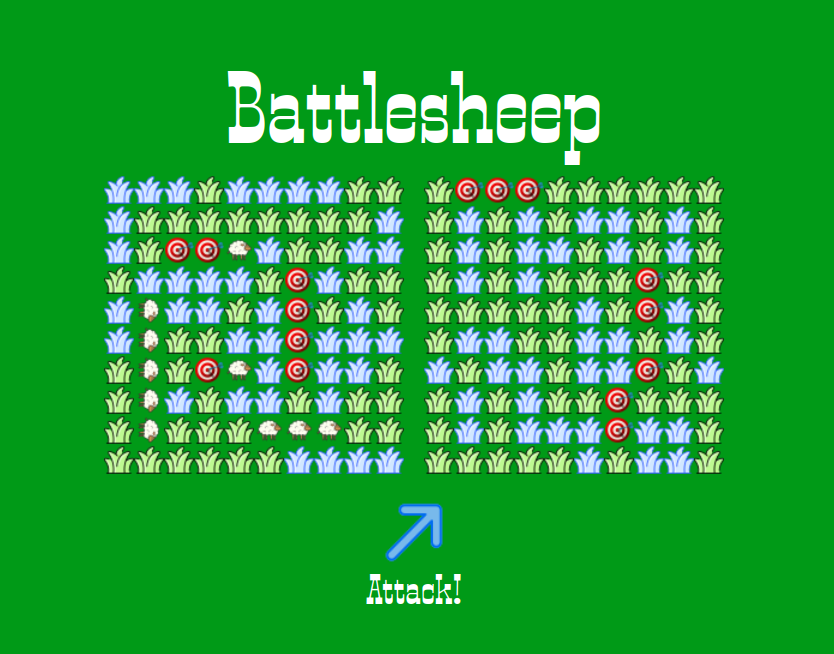

# Battlesheep [LIVE](https://abstractdev.github.io/Battlesheep/)

============

A "sheepish" take on the classic Battleship game.

---

## Features
- Drag and drop sheep to place on board
- Sheep can be placed horizontally or vertically
- Simple AI - clicks randomly - will not click on the same square twice
## Built With
- Vanilla Javascript
- SCSS
- Webpack
- Jest
## Concepts / Things I learned
- Test Driven Development
- Recursion
- Factory Functions
- Implementing drag and drop
- Creating drag images and hiding them
---

